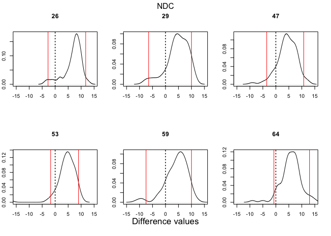

<!-- README.md is generated from README.Rmd. Please edit that file -->

# P2C2M2

<!-- badges: start -->
<!-- badges: end -->

P2C2M2 provides functions to read default output from BEAST 2 (Bouckaert
et al. 2019) and StarBEAST2 (Ogilvie et al. 2017) and conduct posterior
predictive checks of coalescent models (Reid et al. 2014) based on the
functions originally provided in the P2C2M package (Gruenstaeudl et
al. 2016) to parse tree and xml files from BEAST and \*BEAST. It also
implements estimation of type-I (false-positive) error rates using
pseudo-observed datasets (“pods”) sampled from the posterior predictive
distribution.

## Installation

You can install the development version of P2C2M2 from
[GitHub](https://github.com/) with:

``` r
# install.packages("devtools")
devtools::install_version("rPython", version = "0.0-6", repos = "http://cran.us.r-project.org")
devtools::install_github("arleyc/P2C2M2")
```

## Input files

In order to generate the tree files annotated with the required branch
rate estimates, the XML file has to be modified by hand to include the
following code before running BEAST 2:

\#For strict clocks:

Insert the following:<br> <em>substitutions=“true”
branchratemodel=“@StrictClock.c:Locus_Name”</em><br> after
<em>id=“TreeWithMetaDataLogger.t:Locus_Name”</em> and before
<em>spec=“beast.base.evolution.TreeWithMetaDataLogger”</em>

\#For UCLN or RLC clocks:

Insert the following:<br> <em>substitutions=“true”</em><br> after
<em>id=“TreeWithMetaDataLogger.t:Locus_Name”</em> and before
<em>spec=“beast.base.evolution.TreeWithMetaDataLogger”</em>

## Example

Basic example showing how to run the full pipeline with a single
function using the provided dataset to test the multispecies coalescent
model and to estimate false positive error rates per locus and across
loci:

``` r
library(P2C2M2)

# The absolute path to the input directory is set
inPath <- system.file("extdata", "thomomys/", package="P2C2M2")

# The name of the xml-file generated by BEAUTi and located in 
# "inPath" is set
inFile <- "thomomys.xml"

# Posterior predictive simulations with a setting of 10 simulation 
# replicates are preformed
suppressWarnings(thomomys <- p2c2m2.complete(inPath, inFile, num.reps=10, error.rate = TRUE, save.metadata = TRUE))
#> 
#> bindings, loci, and alignments read
#> 
#> locus 26 is done
#> 
#> locus 29 is done
#> 
#> locus 47 is done
#> 
#> locus 53 is done
#> 
#> locus 59 is done
#> 
#> locus 64 is done
#> 
#> locus 72 is done
#> 
#> gene trees done
#> 
#> species trees done
#> 
#> Calculating metrics for 91 trees of the posterior distribution
#> 
#> Calculating metrics for the trees of the post. predictive distribution
#> 
#> Calculating differences btw. the posterior and the post. predictive distribution
#> 
#> Calculating differences btw. 1000 pods and the post. predictive distribution to estimate error rates

thomomys$results$alpha0.01
#> $perGene
#>    LCWT[2]              NDC[2]             
#> 26 "-3.09 (±6.81) n.s." "6.44 (±3.62) n.s."
#> 29 "-1.78 (±5.55) n.s." "4.74 (±3.9) n.s." 
#> 47 "-1.36 (±6.19) n.s." "4.31 (±3.96) n.s."
#> 53 "-3.12 (±6.95) n.s." "3.79 (±4.09) n.s."
#> 59 "-0.6 (±7.48) n.s."  "4.84 (±4.32) n.s."
#> 64 "-2.9 (±6.72) n.s."  "5.73 (±4.23) n.s."
#> 72 "-0.28 (±5.29) n.s." "2.09 (±4.65) n.s."
#> 
#> $acrGenes
#>        LCWT[2]                NDC[2]               
#> Sum    "-13.14 (±25.34) n.s." "31.92 (±14.65) n.s."
#> Mean   "-1.88 (±3.62) n.s."   "4.56 (±2.09) n.s."  
#> Median "0 (±0) n.s."          "5 (±1.2) *"         
#> Mode   "0 (±0) 0"             "5.29 (±1.59) *"     
#> CV     "-13.73 (±90.42) n.s." "0.08 (±6.75) n.s."  
#> 
#> $perGene.error
#>    LCWT[2] NDC[2]
#> 26   0.018  0.000
#> 29   0.027  0.034
#> 47   0.027  0.020
#> 53   0.029  0.024
#> 59   0.034  0.012
#> 64   0.021  0.041
#> 72   0.020  0.017
#> 
#> $acrGenes.error
#>        LCWT[2] NDC[2]
#> Sum      0.027  0.018
#> Mean     0.027  0.018
#> Median   0.702  0.256
#> Mode     0.633  0.197
#> CV       0.018  0.018

thomomys$results$legend
#> [1] "Differences between the posterior and the posterior predictive distributions per locus and across loci. Each cell contains the following information in said order: mean, standard deviation, significance level. Error rates (if estimated with option error.rate=TRUE) are based on differences between the pods and the posterior predictive distributions. Codes in square brackets indicate the number of tails. Alpha values are automatically adjusted for the number of tails."
```

Plot distributions of difference values for each locus based on the NDC
statistic:

``` r
graphics::par(mfrow=c(2,3), mar=c(5, 2, 5, 2) + 0.1)
for (i in 1:6){plot(density(thomomys$metaData$NDC$dif[,i]),main=noquote(thomomys$inData$loci$dta[[i]]),xlab="",ylab="")}
par(mfrow=c(1,1))
mtext("Difference values",side=1,cex=1.1,line=3)
mtext("NDC",side=3,cex=1,line=4)
```



## References

Bouckaert, R., Vaughan, T.G., Barido-Sottani, J., Duchêne, S., Fourment,
M., Gavryushkina, A., Heled, J., Jones, G., Kühnert, D., De Maio, N.,
Matschiner, M., Mendes, F.K., Müller, N.F., Ogilvie, H.A., du Plessis,
L., Popinga, A., Rambaut, A., Rasmussen, D., Siveroni, I., Suchard,
M.A., Wu, C.H., Xie, D., Zhang, C., Stadler, T., Drummond, A.J. (2019)
BEAST 2.5: An advanced software platform for Bayesian evolutionary
analysis. PLoS Computational Biology, 15(4), e1006650.

Gruenstaeudl, M., Reid, N.M., Wheeler, G.R., Carstens, B.C. (2016)
Posterior predictive checks of coalescent models: P2C2M, an R package.
Molecular Ecology Resources, 6, 193–205.

Ogilvie, H.A., Bouckaert, R.R., Drummond, A.J. (2017) StarBEAST2 brings
faster species tree inference and accurate estimates of substitution
rates. Molecular Biology and Evolution, 34(8), 2101-–2114.

Reid, N.M., Brown, J.M., Satler, J.D., Pelletier, T.A., McVay, J.D.,
Hird, S.M., Carstens, B.C. (2014) Poor fit to the multi-species
coalescent model is widely detectable in empirical data. Systematic
Biology, 63, 322–333.

## Citation

Villamil, J., Morando, M., Avila, L.J., Lanna, F.M., Fonseca, E.M.,
Sites, Jr., J.W., Camargo, A. Revisiting the problem of Multispecies
Coalescent Model fit with an example from a complete molecular phylogeny
of the <em>Liolaemus wiegmannii</em> species group (Squamata:
Liolaemidae), in review.
